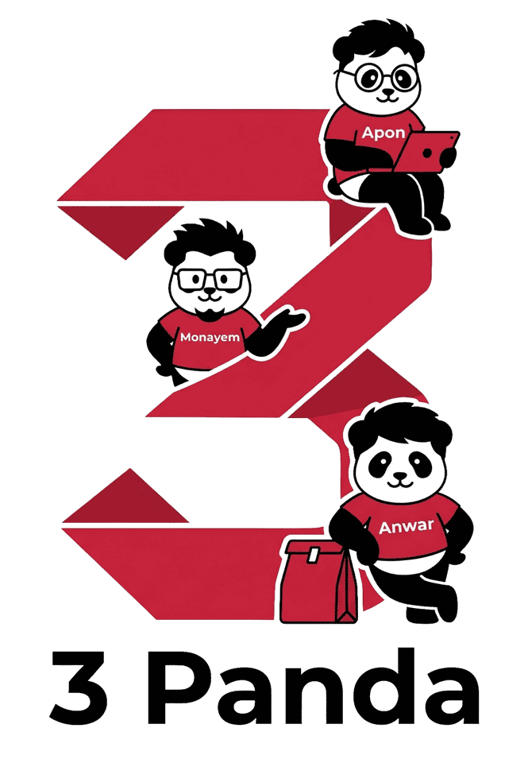

<p align="center">
  
</p>

<h1 align="center">3 Panda</h1>
<p align="center"><strong>University DBMS Lab Course Project</strong></p>

<p align="center">
  
  
  
  
</p>

<p align="center">
  A full-stack, role-based food delivery platform demonstrating practical database design,
  relational integrity, role-based workflows, and real deployment with a cloud database.
</p>

---

## Quick Overview

| Item | Details |
|---|---|
| Project Name | 3 Panda |
| Course Context | DBMS Lab Project |
| Architecture | Monolithic Web Application |
| Backend | Node.js + Express |
| Frontend | HTML + CSS + Vanilla JavaScript |
| Database | TiDB Serverless (MySQL-compatible) |
| Media Storage | Cloudinary |
| Deployment | Render |

## Table of Contents

- [Project Highlights](#project-highlights)
- [Tech Stack](#tech-stack)
- [DBMS Concepts Demonstrated](#dbms-concepts-demonstrated)
- [Roles and Main Workflows](#roles-and-main-workflows)
- [Database Schema (Core Tables)](#database-schema-core-tables)
- [API Overview](#api-overview)
- [Project Structure](#project-structure)
- [Setup Instructions (Local)](#setup-instructions-local)
- [Demo Credentials (Lab)](#demo-credentials-lab)
- [URL Routing](#url-routing)
- [Deployment (Render)](#deployment-render)
- [Performance Notes](#performance-notes)
- [Security and Validation](#security-and-validation)
- [Known Limitations (Academic Scope)](#known-limitations-academic-scope)
- [Team](#team)
- [License](#license)

## Project Highlights

- Multi-role system: `admin`, `vendor`, `delivery`, `customer`
- End-to-end food ordering lifecycle
- Restaurant approval flow for vendors
- Delivery assignment and status tracking
- Reviews and vendor replies
- Cloud-hosted image uploads (Cloudinary)
- MySQL/TiDB schema with constraints, foreign keys, and indexes
- Clean extensionless routes (`/admin`, `/delivery`, etc.)
- Mobile-focused UI and performance optimizations

## Tech Stack

- Backend: Node.js, Express
- Database: TiDB Serverless (MySQL-compatible)
- Frontend: HTML, CSS, Vanilla JavaScript
- Auth: JWT + bcrypt password hashing
- File Uploads: Multer + Cloudinary
- Deployment: Render

## DBMS Concepts Demonstrated

This project was designed to align with DBMS lab goals:

- ER-to-relational mapping
- Primary keys, foreign keys, and referential actions
- Domain constraints via `CHECK`
- Normalized structure (`Orders` and `OrderDetails` split)
- Role-based data access at API level
- Indexing for frequently queried attributes
- Transaction-like consistency through server-side validation and controlled write flow

## Roles and Main Workflows

### Customer

- Register/login
- Browse restaurants and menu items
- Place orders with map pin delivery location
- Track own order history and status
- Submit/edit/delete reviews

### Delivery Rider

- See pending/assignable orders
- View multi-stop delivery map
- Update order status (`confirmed` -> `preparing` -> `out_for_delivery` -> `delivered`)
- View completed delivery history

### Vendor

- Submit restaurant for approval
- Manage own approved restaurants
- Manage menu items under own restaurants
- Reply to customer reviews on owned restaurants

### Admin

- Manage users, restaurants, menu items
- Approve/reject vendor restaurants
- Manage all orders and status
- See platform stats and revenue

## Database Schema (Core Tables)

- `Users`
- `Restaurants`
- `Categories`
- `MenuItems`
- `Orders`
- `OrderDetails`
- `Reviews`

Schema file:

- `database/schema.sql`

Migration helper for marketplace upgrade:

- `database/migrate_vendor.sql`

## API Overview

Main route groups:

- Auth: `/api/register`, `/api/login`
- Restaurants: `/api/restaurants`, `/api/vendor/restaurants`
- Menu: `/api/menu-items`, `/api/vendor/menu-items`
- Users/Profile: `/api/users`, `/api/users/profile`
- Orders: `/api/orders`, `/api/orders/mine`, `/api/orders/:id/status`
- Delivery: `/api/delivery/pending`, `/api/delivery/history`
- Reviews: `/api/reviews`, `/api/reviews/:id`, `/api/reviews/:id/reply`
- Health: `/api/health`

## Project Structure

```text
3Panda/
  backend/
    keepalive.js
    package.json
    server.js
  database/
    schema.sql
    migrate_vendor.sql
  frontend/
    index.html
    login.html
    profile.html
    my-orders.html
    delivery.html
    admin.html
    vendor.html
    app.js
    style.css
  render.yaml
```

## Setup Instructions (Local)

### 1) Install dependencies

```bash
cd backend
npm install
```

### 2) Configure environment variables

Create `backend/.env` with:

```env
TIDB_HOST=your_tidb_host
TIDB_PORT=4000
TIDB_USER=your_tidb_user
TIDB_PASSWORD=your_tidb_password
TIDB_DATABASE=your_tidb_database

CLOUDINARY_CLOUD_NAME=your_cloud_name
CLOUDINARY_API_KEY=your_api_key
CLOUDINARY_API_SECRET=your_api_secret
```

### 3) Run the server

```bash
npm run dev
```

or

```bash
npm start
```

Server default:

- `http://localhost:3000`

The backend serves frontend static files directly, so no separate frontend build step is required.

### 4) First run behavior

On startup, the app loads and executes `database/schema.sql` statements (safe `IF NOT EXISTS` / compatible behavior), creates tables/indexes, and seeds default records where needed.

## Demo Credentials (Lab)

Default admin user from schema seed:

- Email: `admin@3panda.ddns.net`
- Password: `admin123`

Change default credentials before any public/long-term deployment.

## URL Routing

The app now supports clean URLs and redirects old `.html` routes:

- `/` -> Home
- `/login`
- `/profile`
- `/my-orders`
- `/delivery`
- `/admin`
- `/vendor`

Legacy routes like `/admin.html` redirect to `/admin`.

## Deployment (Render)

Deployment config is included in:

- `render.yaml`

It defines:

- Web service for backend (`backend/` root)
- Cron service for periodic keepalive ping
- Required environment variables for TiDB + Cloudinary

## Performance Notes

Recent optimizations for low-end/mobile devices:

- Delegated click handling for restaurant cards
- Lazy/async image decode hints for dynamic card images
- Off-screen rendering optimization via `content-visibility`
- Reduced unnecessary runtime overhead in card-heavy views

All done without changing product features or visual design.

## Security and Validation

- JWT authentication and role-based authorization
- Password hashing with bcrypt
- Server-side validation for role-sensitive actions
- MIME/type checks and upload size limits for images
- Ownership checks for vendor operations and review replies

## Known Limitations (Academic Scope)

- No external payment gateway integration (cash flow simulated)
- No automated test suite yet
- Single-service monolithic architecture (intentional for lab scope)
- Some admin/vendor paths are optimized for demonstration workflow

## Team

Built by:

- Apon
- Monayem
- Anwar

## License

This project was developed for academic coursework. Reuse according to your university policy and team agreement.
